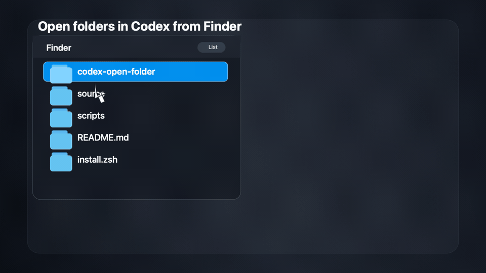

# Open in Codex for Finder

`Open in Codex` is a macOS Finder Quick Action for project folders.



Right-click a folder, choose `Open in Codex`, and it routes to the best available Codex destination:

- the newest existing Codex chat for that exact folder
- the saved Codex project for that folder
- a prompt for new folders, with options to open the folder as a Codex project, open Codex without the folder, or cancel

The tool is intentionally small and dependency-free. It uses macOS built-ins only: `zsh`, `sqlite3`, `plutil`, `osascript`, and `open`. Users do not need Node, npm, Rust, Homebrew, or the Codex CLI to install or run the Quick Action.

## Why This Exists

Codex Desktop already understands workspaces and folder documents, but Finder does not ship a smart `Open in Codex` action today. This fills that gap without making Codex the default app for every folder.

The helper is conservative. It only opens an existing chat when the selected folder exactly matches the chat's recorded `cwd`. It avoids guessing from Git repos, package files, folder names, parent folders, or similar paths.

If Codex later adds a native Finder action, run `./uninstall.zsh` and use the built-in version.

## Install

Requirements:

- macOS
- Codex Desktop installed as `/Applications/Codex.app`

From this repository:

```bash
./install.zsh
```

Then right-click a folder in Finder and choose `Quick Actions` or `Services` > `Open in Codex`.

If macOS does not show it immediately, log out and back in or run the installer again.

## Uninstall

```bash
./uninstall.zsh
```

The uninstaller removes only files this project owns:

- `~/Library/Services/Open in Codex.workflow`
- `~/.codex/bin/codex-open-folder.zsh`
- the old pre-zsh helper path, `~/.codex/bin/codex-open-folder.mjs`, if present
- `~/.config/open-in-codex/fallback-mode`

## Share Assets

Use these when posting or linking to the project:

- `media/open-in-codex-twitter-card.png`: simpler 1600x900 X/Twitter image with the larger Codex mark
- `media/open-in-codex-demo.mp4`: more accurate 5 second 1280x720 Finder Quick Actions video for GitHub releases
- `media/open-in-codex-demo.gif`: more accurate animated README preview
- `media/open-in-codex-demo-poster.png`: more accurate 1280x720 still frame
- `media/open-in-codex-card.png`: same image as the Twitter card, kept as a shorter filename

To regenerate the assets:

```bash
swift -module-cache-path /private/tmp/swift-module-cache tools/render-assets.swift media /private/tmp/open-in-codex-media-frames
ffmpeg -y -framerate 30 -i /private/tmp/open-in-codex-media-frames/frame%04d.png -vf "scale=1280:720:flags=lanczos" -c:v libx264 -pix_fmt yuv420p -movflags +faststart media/open-in-codex-demo.mp4
ffmpeg -y -framerate 30 -i /private/tmp/open-in-codex-media-frames/frame%04d.png -vf "fps=15,scale=960:-1:flags=lanczos,split[s0][s1];[s0]palettegen=max_colors=96[p];[s1][p]paletteuse=dither=bayer:bayer_scale=3" media/open-in-codex-demo.gif
```

The renderer is only for project media. Installing or using the Finder Quick Action does not require Swift or ffmpeg.
The Twitter card uses the local Codex app icon when `/Applications/Codex.app` is installed; otherwise the renderer falls back to a vector approximation.

## Install With Codex

Paste this into Codex from a checkout of this repository:

```text
Install this macOS Finder Quick Action for me, but do not run the installer until after you inspect the code.

Repository goal:
- Install the pure zsh helper from ./bin/codex-open-folder.zsh to ~/.codex/bin/codex-open-folder.zsh.
- Create or replace ~/Library/Services/Open in Codex.workflow.
- Register it as a Finder-only Quick Action named "Open in Codex".
- Restrict it to folders only with NSSendFileTypes = public.folder.
- Use only macOS built-ins: zsh, sqlite3, plutil, osascript, and open.
- Refresh macOS Services after installation.

Safety requirements:
- Before running ./install.zsh, inspect README.md, bin/codex-open-folder.zsh, install.zsh, uninstall.zsh, and test/run.zsh.
- Scan for credential reads, environment exfiltration, network egress, lifecycle hooks, hidden downloads, destructive operations outside this project's owned install paths, and obfuscated Unicode.
- Do not read, print, copy, upload, or summarize secrets or token-bearing config files.
- Run the install script only if that scan finds no issues.
- If you find an issue, stop and report the exact file and line instead of installing.

Verification:
- zsh -n bin/codex-open-folder.zsh install.zsh uninstall.zsh test/run.zsh
- zsh test/run.zsh
- OPEN_IN_CODEX_INSTALL_HOME=/private/tmp/open-in-codex-install-test ./install.zsh --no-refresh
- plutil -lint /private/tmp/open-in-codex-install-test/Library/Services/Open\ in\ Codex.workflow/Contents/Info.plist
- plutil -lint /private/tmp/open-in-codex-install-test/Library/Services/Open\ in\ Codex.workflow/Contents/document.wflow

After installing, verify:
- the Services registry contains "Open in Codex"
- the service is Finder-only
- the service accepts public.folder
- Finder shows "Open in Codex" in the Services or Quick Actions menu for a selected folder

Report the exact verification results.
```

## How It Chooses What To Open

The helper uses Codex Desktop's local state and exact folder paths.

1. It normalizes the selected Finder folder to an absolute path and also tries the folder's real path, so symlinked selections can still match.
2. It checks `~/.codex/state_5.sqlite` for the newest unarchived row in `threads` whose `cwd` exactly matches one of those folder paths.
3. If a matching thread exists, it opens `codex://threads/<thread-id>`.
4. If no exact thread exists, it checks `~/.codex/.codex-global-state.json` for `electron-saved-workspace-roots`.
5. If the folder is already saved as a Codex project, it opens that folder with Codex Desktop.
6. If the folder is neither a known chat nor a saved project, it asks what to do.

For a new folder, the prompt has three outcomes:

- `Open Project`: opens the selected folder in Codex Desktop.
- `Open Codex`: opens Codex Desktop without attaching the folder.
- `Cancel`: does nothing.

## Compatibility Fallback

This tool relies on Codex local state that may change in future Codex releases.

Before smart routing, the helper validates the expected local state contract:

- `~/.codex/state_5.sqlite` exists
- it contains a `threads` table
- `threads` has the expected `id`, `cwd`, `archived`, and `updated_at` columns
- if `~/.codex/.codex-global-state.json` exists, `electron-saved-workspace-roots` is an array

If that contract breaks, the helper does not guess. It:

1. saves fallback mode at `~/.config/open-in-codex/fallback-mode`
2. shows a dialog explaining that Codex local state changed
3. offers to open [this repository](https://github.com/PatrickJS/codex-open-folder) for updates
4. opens only Codex on future runs, without trying to inspect chats or projects

Run `./uninstall.zsh` if you want to remove the Quick Action entirely.

## Development

Run the behavior tests:

```bash
zsh test/run.zsh
```

Check script syntax:

```bash
zsh -n bin/codex-open-folder.zsh install.zsh uninstall.zsh test/run.zsh
```

Test the installer against a temporary home:

```bash
OPEN_IN_CODEX_INSTALL_HOME=/private/tmp/open-in-codex-install-test ./install.zsh --no-refresh
plutil -lint /private/tmp/open-in-codex-install-test/Library/Services/Open\ in\ Codex.workflow/Contents/Info.plist
plutil -lint /private/tmp/open-in-codex-install-test/Library/Services/Open\ in\ Codex.workflow/Contents/document.wflow
```

## Files

- `bin/codex-open-folder.zsh`: Finder helper and smart routing logic
- `install.zsh`: installs the helper and Automator workflow
- `uninstall.zsh`: removes files owned by this project
- `test/run.zsh`: behavior tests for routing and fallback mode
- `tools/render-assets.swift`: source for the README and social media graphics
